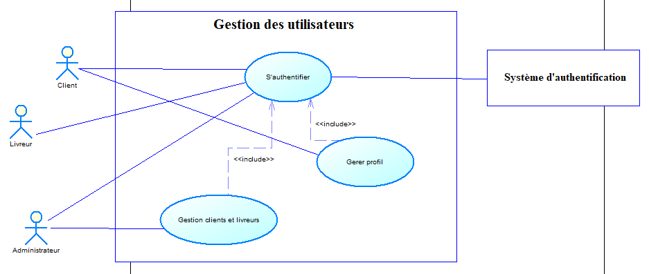
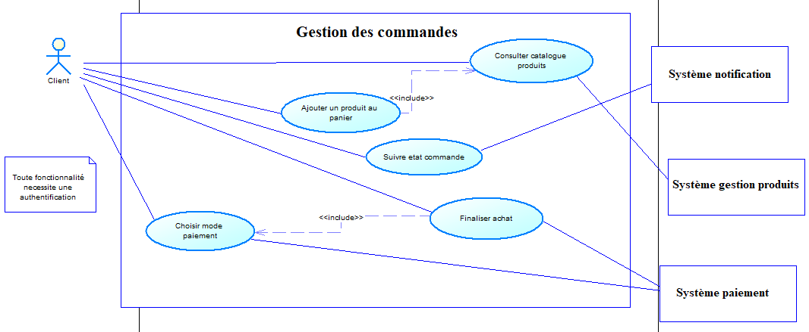
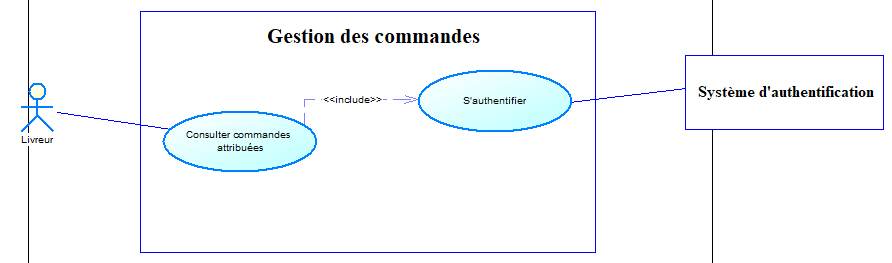
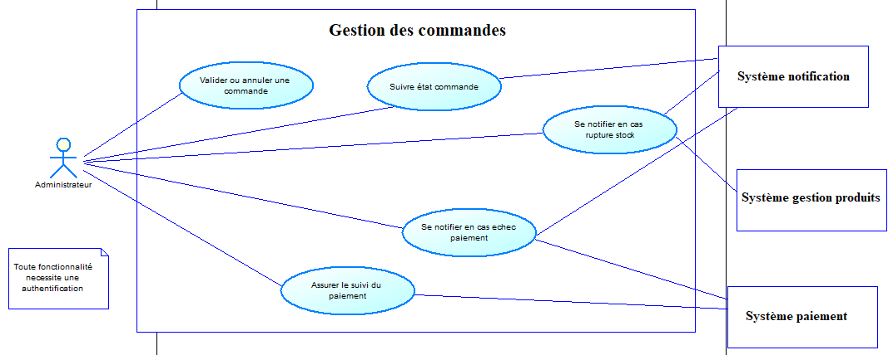
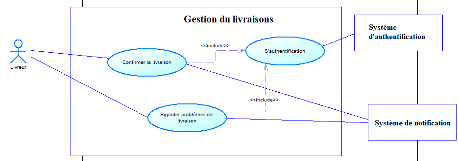

# Excercices UML (Diagramme de cas d'utilisation)

## Excercice 1 : 

Dans un établissement scolaire, on désire gérer la réservation des salles de cours ainsi que
du matériel pédagogique (ordinateur portable ou/et Vidéo projecteur).
  
Seuls les enseignants sont habilités à effectuer des réservations (sous réserve de
disponibilité de la salle ou du matériel).
  
Le planning des salles peut quant à lui être consulté par tout le monde (enseignants et
étudiants).
  
Par contre, le récapitulatif horaire par enseignant (calculé à partir du planning des salles)
ne peut être consulté que par les enseignants.
  
Enfin, il existe pour chaque formation un enseignant responsable qui seul peut éditer le
récapitulatif horaire pour l’ensemble de la formation.
  

<b>Travail à faire :</b>

1 - Identifier les acteurs du système

2 - Donner pour chaque acteur la liste des cas d’utilisation auquel il participe

3 - Elaborer le diagramme de cas d’utilisation

 

### Solution : 

<b>1 - Les acteurs du système sont : </b>

<ul>
<li>Etudiant</li>
<li>Enseignant</li>
<li>Enseignant résponsable</li>
</ul>
 

<b>1 - Cas d'utilisation pour chaque acteur du système :</b>

<table>
<thead>
<tr>
<th>Acteur</th>
<th>Cas d'utilisation associé</th>
</tr>
</thead>
<tbody>
<tr>
<td>Etudiant</td>
<td>
<ul>
<li>Consulter le planning des salles</li>
</ul>
</td>
</tr>

<tr>
<td>Enseignant</td>
<td>
<ul>
<li>Consulter le planning des salles</li>
<li>Consulter le récapitulatif horaire</li>
<li>Effectuer des réservation (salles/matériels pédagogiques)</li>
</ul>
</td>
</tr>

<tr>
<td>Enseignant résponsable</td>
<td>
<ul>
<li>Consulter le planning des salles</li>
<li>Consulter le récapitulatif horaire</li>
<li>Editer le récapitulatif horaire de sa formation</li>
<li>Effectuer des réservation (salles/matériels pédagogiques)</li>
</ul>
</td>
</tr>
</tbody>
</table>
 

<b>3 - Diagramme de cas d'utilisation : </b>

  

  

## Excercice 2 : 

Une entreprise souhaite développer un système de gestion des commandes en ligne pour
permettre aux clients de passer des commandes, aux administrateurs de gérer les produits
et aux livreurs de suivre les livraisons. L'objectif principal est d'automatiser l'ensemble du
processus d'achat en ligne, en assurant une gestion fluide des interactions entre les
différents acteurs.

<b><u>Description du système: </u></b>
 
L'application doit permettre aux clients, après une authentification sécurisée, de naviguer
dans un catalogue de produits, de les ajouter à un panier, et de finaliser leurs achats via un
système de paiement intégré. Une fois la commande passée, le client doit pouvoir suivre
son état (préparation, expédition, livraison) et recevoir des notifications à chaque
changement de statut.
 
L'administrateur du système doit pouvoir gérer le catalogue de produits, valider ou annuler
les commandes et assurer le suivi des paiements. Il est également responsable de la gestion
des utilisateurs et des livreurs. En cas de problème de stock ou d'échec de paiement, il est
averti et peut prendre des mesures correctives.
 
Le livreur, quant à lui, doit pouvoir consulter les commandes qui lui sont attribuées, mettre
à jour le statut de la livraison en temps réel et confirmer la réception par le client. Il doit
également signaler tout problème de livraison via le système.

 

<b><u>Fonctionnalité du système: </u></b>
 
Gestion des comptes utilisateurs :
<ul>
<li>Un client peut s'inscrire, se connecter et gérer son profil.</li>
<li>Un administrateur gère les comptes des utilisateurs et les livreurs.</li>
<li>Un client peut parcourir les produits disponibles.</li>
<li>Il peut ajouter des produits au panier et passer une commande.</li>
<li>Il peut choisir un mode de paiement et effectuer la transaction.</li>
</ul>
 
Gestion des commandes :
<ul>
<li>Une commande peut être validée ou annulée par l’administrateur.</li>
<li>Un client peut suivre l’état de sa commande.</li>
<li>Un livreur peut voir les commandes qui lui sont attribuées et mettre à jour leur statut.</li>
<li>Le client reçoit une notification lorsqu’une commande est expédiée ou livrée.</li>
<li>L’administrateur est averti en cas de problème de paiement ou de rupture de stock.</li>
</ul>
 
Gestion des livraisons :
<ul>
<li>Le livreur consulte les commandes en attente de livraison.</li>
<li>Il peut confirmer la livraison une fois effectuée.</li>
<li>Il peut également signaler un problème en cas d'impossibilité de livraison.</li>
</ul>

  

<b>Travail demandé :</b>

1 - Identifier les acteurs impliqués dans le système (au moins trois).

2 - Lister les cas d’utilisation principaux et les associer aux acteurs concernés.

3 - Représenter le diagramme de cas d'utilisation UML.

 
<h3>Solution :</h3>
 

<b>1 - Les acteurs du système :</b>

<ul>
<li>Client (acteur principal)</li>
<li>Administrateur (acteur principal)</li>
<li>Livreur (acteur principal)</li>
<li>Système de gestion de produit (acteur secondaire)</li>
<li>Système de notification (acteur secondaire)</li>
<li>Système de paiement (acteur secondaire)</li>
</ul>
 

<b>2 - Les acteurs du système :</b>

<table>
<thead>
<tr>
<th>Acteur</th>
<th>Cas d'utilisation</th>
</tr>
</thead>
<tbody>
<tr>
<td>Client (acteur principal)</td>
<td>
<ul>
<li>S'authentifier</li>
<li>Gerer son profil</li>
<li>Naviguer dans le catalogue du produits</li>
<li>Ajouter un produit au panier</li>
<li>Suivre l'état de la commande</li>
<li>Choisir un mode de paiement</li>
<li>Finaliser l'achat</li>
</ul>
</td>
</tr>

<tr>
<td>Administrateur (acteur principal)</td>
<td>
<ul>
<li>S'authentifier</li>
<li>Valider ou annuler les commandes</li>
<li>Suivre l'état de la commande</li>
<li>Assurer le suivi des paiements</li>
<li>Gestion des clients, et des livreurs</li>
<li>Se notifier en cas d'echec de paiement, ou rupture en stock</li>
</ul>
</td>
</tr>

<tr>
<td>Livreur (acteur principal)</td>
<td>
<ul>
<li>S'authentifier</li>
<li>Consulter les commandes qui lui sont attribuées</li>
<li>Confirmer la livraison une fois effectuée</li>
<li>Signaler des problèmes de livraison</li>
</ul>
</td>
</tr>

<tr>
<td>Système d'authentification (acteur secondaire)</td>
<td>
<ul>
<li>S'authentifier</li>
</ul>
</td>
</tr>

<tr>
<td>Système de paiement (acteur secondaire)</td>
<td>
<ul>
<li>Choisir un mode de paiement</li>
<li>Assurer le suivi du paiement</li>
<li>Finaliser l'achat</li>
</ul>
</td>
</tr>

<tr>
<td>Système de Notification (acteur secondaire)</td>
<td>
<ul>
<li>Suivre l'état de la commande</li>
<li>Se notifier en cas d'echec de paiement, ou rupture en stock</li>
<li>Signaler des problèmes de livraison</li>
</ul>
</td>
</tr>
</tbody>
</table>
 

<b>3 - Diagramme de cas d'utilisation </b>

<b>3 - 1 System de gestion des utilisateurs</b>

 

<b>3 - 2 System de gestion des commandes (par acteur client)</b>

 

<b>3 - 3 System de gestion des commandes (par acteur livreur)</b>

 

<b>3 - 4 System de gestion des commandes (par acteur administrateur)</b>

 

<b>3 - 5 System de gestion livraison</b>

